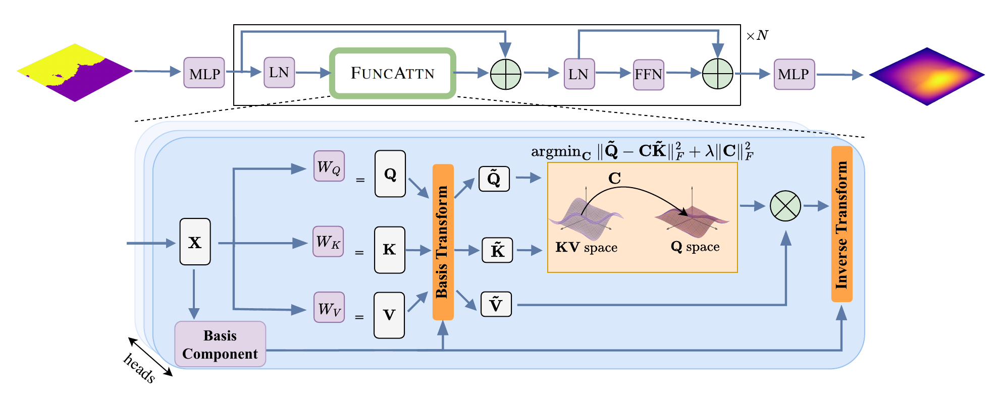
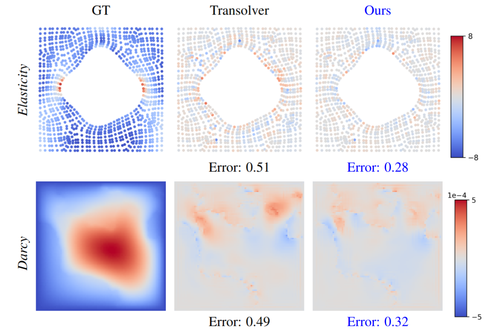
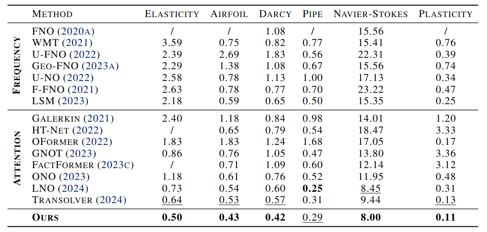

# Functional Attention: From Pairwise Affinities to Functional Correspondences

> **Accepted at ICML 2026.**

Welcome to the official implementation of [Functional Attention: From Pairwise Affinities to Functional Correspondences (ICML 2026)](https://arxiv.org/pdf/2605.31559). You can find the project page [here](https://xjffff.github.io/funcattn/).


We introduce **Functional Attention (FuncAttn)**, which reinterprets attention as a *functional correspondence* between adaptive bases rather than pairwise affinities between tokens. Inspired by the functional maps framework, FuncAttn replaces the dense softmax score matrix with a compact linear operator learned via optimal least-squares in a spectral space, reducing complexity from O(n²) to O(k²) with k ≪ n.

---

## Architecture



---

## Showcase



Qualitative comparison against Transolver on Elasticity (top) and Darcy flow (bottom). FuncAttn produces predictions with lower relative error.

---

## Repository Structure

| Directory | Description |
|-----------|-------------|
| [`Few-Shot-Regression/`](Few-Shot-Regression/) | Few-shot sinusoid regression comparing FuncAttn, Attention, Intention, Transolver |
| [`PDE-StandardBenchmark/`](PDE-StandardBenchmark/) | Six PDE benchmarks: Darcy, Navier-Stokes, Airfoil, Pipe, Plasticity, Elasticity |
| [`RNA-Segmentation/`](RNA-Segmentation/) | 3D point cloud segmentation on RNA structures |
| [`Airfoil-Design-AirfRANS/`](Airfoil-Design-AirfRANS/) | OOD generalization on the AirfRANS airfoil design dataset |
| [`Burgers-Super-Res/`](Burgers-Super-Res/) | Zero-shot super-resolution on the 1D Burgers equation |

---

## Installation

```bash
pip install -r requirements.txt
```

---

## Results



Relative L² error (%) on six standard PDE benchmarks. FuncAttn outperforms the previous best model Transolver across all tasks.

---

## Acknowledgement

We appreciate the following GitHub repos for their valuable code base and datasets on which we built our code:

1. https://github.com/neuraloperator/neuraloperator
2. https://github.com/thuml/Transolver
3. https://github.com/Extrality/AirfRANS
4. https://github.com/nmwsharp/diffusion-net

   
## Citation
If you find our work useful in your research, please consider citing:

```bibtex
@misc{xiao2026functionalattentionpairwiseaffinities,
      title={Functional Attention: From Pairwise Affinities to Functional Correspondences}, 
      author={Jiefang Xiao and Maolin Gao and Simon Weber and Guandao Yang and Daniel Cremers},
      year={2026},
      eprint={2605.31559},
      archivePrefix={arXiv},
      primaryClass={cs.LG},
      url={https://arxiv.org/abs/2605.31559}, 
}
```
